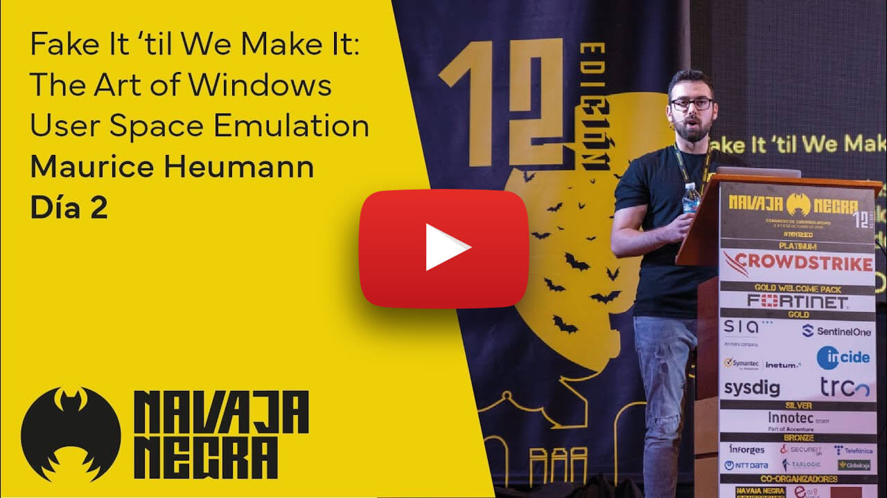

<h1 align="center">
	
	<br>
	<a href="https://github.com/momo5502/sogen?tab=GPL-2.0-1-ov-file"></a>
	<a href="https://github.com/momo5502/sogen/actions"></a>
	<a href="https://github.com/momo5502/sogen/issues"></a>
	  
	<a href="https://deepwiki.com/momo5502/sogen"></a>
</h1>

Sogen is a high-performance Windows user space emulator that operates at syscall level, providing full control over process execution through comprehensive hooking capabilities.

Perfect for security research, malware analysis, and DRM research where fine-grained control over process execution is required.

Built in C++ and powered by the [Unicorn Engine](https://github.com/unicorn-engine/unicorn) (or the [icicle-emu](https://github.com/icicle-emu/icicle-emu) 🆕).

Try it out: <a href="https://sogen.dev">sogen.dev</a>

## Key Features

* 🔄 __Syscall-Level Emulation__
	* Instead of reimplementing Windows APIs, the emulator operates at the syscall level, allowing it to leverage existing system DLLs
* 📝 __Advanced Memory Management__
	* Supports Windows-specific memory types including reserved, committed, built on top of Unicorn's memory management
* 📦 __Complete PE Loading__
	* Handles executable and DLL loading with proper memory mapping, relocations, and TLS
* ⚡ __Exception Handling__
	* Implements Windows structured exception handling (SEH) with proper exception dispatcher and unwinding support
* 🧵 __Threading Support__
	* Provides a scheduled (round-robin) threading model
* 💾 __State Management__
	* Supports both full state serialization and ~~fast in-memory snapshots~~ (currently broken 😕)
* 💻 __Debugging Interface__
	* Implements GDB serial protocol for integration with common debugging tools (IDA Pro, GDB, LLDB, VS Code, ...)

##
> [!NOTE]  
> The project is still in a very early, prototypical state. The code still needs a lot of cleanup and many features and syscalls need to be implemented. However, constant progress is being made :)

## Preview


## YouTube Overview

[](https://www.youtube.com/watch?v=wY9Q0DhodOQ)

Click <a href="https://docs.google.com/presentation/d/1pha4tFfDMpVzJ_ehJJ21SA_HAWkufQBVYQvh1IFhVls/edit">here</a> for the slides.

## Quick Start (Windows + Visual Studio)

> [!TIP]  
> Checkout the [Wiki](https://github.com/momo5502/sogen/wiki) for more details on how to build & run the emulator on Windows, Linux, macOS, ...

1\. Checkout the code:

```bash
git clone --recurse-submodules https://github.com/momo5502/sogen.git
```

2\. Run the following command in an x64 Development Command Prompt in the cloned directory:

```bash
cmake --preset=vs2022
```

3\. Build the solution that was generated at `build/vs2022/emulator.sln`

4\. Create a registry dump by running the [grab-registry.bat](https://github.com/momo5502/sogen/blob/main/src/tools/grab-registry.bat) as administrator and place it in the artifacts folder next to the `analyzer.exe`

5\. Run the program of your choice:

```bash
analyzer.exe C:\example.exe
```
